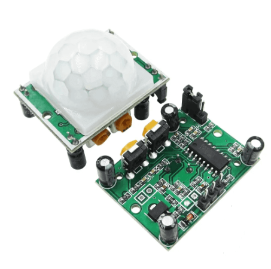

<!--TITLE-->
 

<h3 align="center">Smart Light System</h3>

 

 

 
   
    
  

  
 

<!-- TABLE OF CONTENTS -->

  
Table of Contents

  <ol style="counter-reset: section;">
    <li><a href="#project-introduction">Project introduction</a></li>
    <li><a href="#built-with">Built with</a>
    <ol>
    <li><a href="#software-requirements">Software requirements</a></li>
    <li><a href="#hardware-requirements">Hardware requirements</a></li>
    </ol></li>
    <li><a href="#setting-up-the-hardware">Setting up the hardware</a></li>
    <li><a href="#project-structure">Project structure</a></li>
    <li><a href="#functionalities">Functionalities</a></li>
    <li><a href="#user-guide">User guide</a></li>
    <li><a href="#future-upgrades">Future upgrades</a></li>
    <li><a href="#useful-links">Useful links</a></li>
    <li><a href="#team-members">Team members</a></li>
  </ol>

 
<!--
 -->

<!-- PROJECT INTRODUCTION -->
## Project introduction

 

(<a href="#readme-erpc">back to top</a>)

<!-- BUILT WITH -->
## Built with
C    

 

<h3 style="margin-left: 20px;" id="software-requirements">Software requirements</h3>

Software required to program the boards:  
 &nbsp; &nbsp; → visual studio code: https://code.visualstudio.com/download  
 &nbsp; &nbsp; → code composer studio: https://www.ti.com/tool/download/CCSTUDIO/12.7.0  
 &nbsp; &nbsp; → arduino ide (for ESP-EYE): https://www.arduino.cc/en/software  

<h3 style="margin-left: 20px;" id="hardware-requirements">Hardware requirements</h3>

Hardware components needed to built the device: 

* Texas Instruments MSP432P401R microcontroller 
* Educational BoosterPack MKII 
* ESP-EYE (ESP32)
* HC-SR501 PIR Sensor

(<a href="#readme-erpc">back to top</a>)

<!-- SETTING UP THE HARDWARE -->
## Setting up the hardware

 

(<a href="#readme-erpc">back to top</a>)

<!-- PROJECT STRUCTURE -->
## Project structure

(<a href="#readme-erpc">back to top</a>)

<!-- FUNCTIONALITIES -->
## Functionalities

 

(<a href="#readme-erpc">back to top</a>)

<!-- USER GUIDE -->
## User guide

(<a href="#readme-erpc">back to top</a>)

<!-- FUTURE UPGRADES -->
## Future upgrades

 

(<a href="#readme-erpc">back to top</a>)

<!-- USEFUL LINKS -->
## Useful links

(<a href="#readme-erpc">back to top</a>)

<!-- TEAM MEMBERS -->
## Team members

(<a href="#readme-erpc">back to top</a>)

